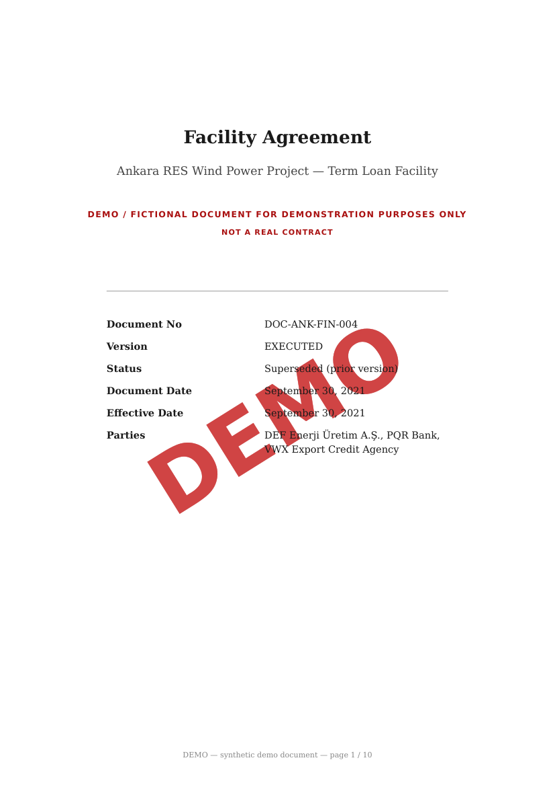
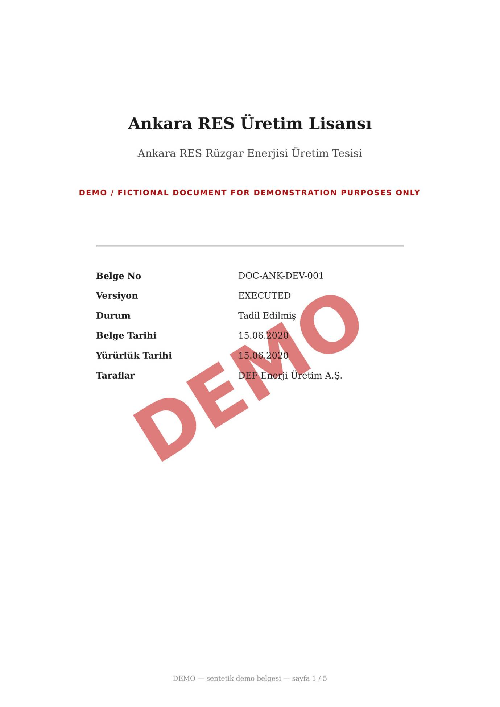
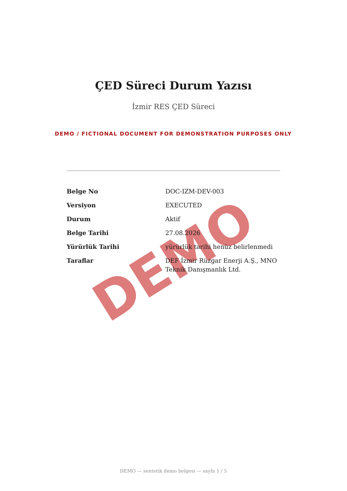

# Phase 3.1 Raporu — 15 demo belge + seed/reset

**Tarih:** 23.09.2026  **Model:** Claude Sonnet 5  **Tag:** phase-3-1  **Commit:** `git rev-list -n1 phase-3-1`

## 1. Kabul kriterleri
| # | Kriter (PHASES.md'den kelimesi kelimesine) | Durum | Kanıt (test adı / komut / çıktı) |
|---|---|---|---|
| 1 | `make seed` → 15 belge `ready` | ✅ | `scripts/seed_demo.sh` iki kez canlı çalıştırıldı (fresh + reset sonrası): her ikisinde de `"wait-for-documents: all ready", "count": 15`; `test_demo_documents_seed.py::test_seed_creates_15_documents_and_queues_jobs` |
| 2 | metadata doğru | ✅ | `test_demo_documents_seed.py::test_seeded_metadata_matches_ledger` (Facility Agreement → `finans`/`normal`/ANK_RES; Board Resolution → `idari_isler`/`board`/proje yok); canlı `GET /api/documents` çıktısı `department`/`project_id` alanlarını doğru gösteriyor |
| 3 | zincir bağlı | ✅ | `test_demo_documents_seed.py::test_facility_chain_is_linear_and_single_current` (DRAFT→EXECUTED→AMD01→AMD02, `evaluate_version_chains()`); `test_demo_documents_seed.py::test_licence_amendment_is_related_not_superseding` (Licence Amendment `related_document_ids`'te, `supersedes`'te değil — kasıtlı tasarım) |
| 4 | "güncel" belge tek | ✅ | Aynı test: yalnızca `DOC-ANK-FIN-006` (AMD02) `is_current=True`; canlı `GET /api/documents` → AMD01 `status:"superseded"`, AMD02 `status:"executed"` |
| 5 | belgeler gerçekçi görünür | ✅ | 3 sayfa-1 thumbnail (`docs/reports/assets/phase_3_1/`, aşağıda) görsel olarak incelendi: DEMO filigranı, çift dilli footer, kapak tablosu, sözleşmede "NOT A REAL CONTRACT" — hepsi doğru |
| 6 | gerçek isim yok (validator) | ✅ | `make validate-documents` (tam, G1-G6 dahil) → `0 error(s), 0 warning(s)`; `test_validate_documents.py::test_real_prose_and_manifest_validate_clean` |
| 7 | `make reset-demo` + `make seed` tekrar çalışır | ✅ | Canlı: `reset_demo.sh --yes` (`TRUNCATE documents CASCADE`, 0.16 sn) → `seed_demo.sh` (15/15 `was_created:true`, 40 sn) → `validate-documents` yine 0 hata |

## 2. Yapılanlar
- **Placeholder tabanlı LLM prose üretimi** (ADR-013'ün somutlaşması): LLM'e yalnızca `[[token]]` placeholder adları ve zorunlu bölüm başlıkları verilir, gerçek rakam/tarih/isim **hiç görmez**. `seed_data/generator/generate_prose.py` — tek seferlik batch (`make prose`), çıktı `prose/*.yaml` (`tag: AI_ASSUMPTION`) commit edilir.
- **Deterministik render** — `seed_data/generator/generate_documents.py`: prose'daki placeholder'ları ledger'dan gelen gerçek değerlerle değiştirir (LLM çağırmaz), Jinja2 (`templates/{base,blocks,agreement,letter,report}.html`) + WeasyPrint ile PDF üretir, sayfa sayımını doğrular, sayfa haritası (`page_map`) ve versiyon zinciri referanslarını hesaplar, taranmış kopyaları (PyMuPDF rasterize) oluşturur. Çıktı: `seed_data/documents/manifest.json` (git'e girmez).
- **Yapısal plan** — `seed_data/generator/document_specs.py`: 15 belgenin bölüm başlıkları/aileleri/ekstra tabloları, tamamen Python'da (rakam yok).
- **Fact çözümleme** — `seed_data/generator/facts.py`: ledger yollarını locale'e uygun (tr-TR, DD.MM.YYYY) string'lere çevirir.
- **Validator** — `seed_data/generator/validate_documents.py`: prose için P1 (3+ haneli sayı/para birimi/gerçek isim sızıntısı yok) + P2 (bölüm sayısı/başlık eşleşmesi), üretilen PDF'ler için G1 (DEMO banner + sözleşmede "NOT A REAL CONTRACT"), G2 (isim whitelist, satır kaydırmalı hücreler için normalize edilmiş metin), G3 (proje izolasyonu — Ankara/İzmir/Bursa karışmıyor), G4 (her `key_facts_used` değeri PDF metninde var), G6 (manifest = 15 belge = `document_specs.py`).
- **App-side seed** — `backend/app/services/demo_documents_seed.py`: `external_ref` anahtarlı create-if-missing (`ensure_demo_documents`), ikinci geçişte `supersedes`/`superseded_by`/`related_document_ids` bağlar (`_relink_chain`, her çalıştırmada yeniden değerlendirilir — türetilmiş veri).
- **`documents.external_ref`** kolonu (migration `0004`) — seed idempotency anahtarı; upload API'sinden asla set edilmez.
- **`scripts/seed_demo.sh`** (ledger doğrula → render → validator → kullanıcı/departman/proje → belgeler → `wait-for-documents`) ve **`scripts/reset_demo.sh`** (yalnızca belgeler; `TRUNCATE documents CASCADE` + dosya silme; kullanıcı/departman/proje korunur).
- **15 belge**: Ankara RES 10 (Üretim Lisansı + Kapasite Tadili, EPC Sözleşmesi + COD Sertifikası, Facility zinciri Draft→Executed→AMD01→AMD02, Covenant Raporu, Üretim Raporu), İzmir RES 4 (Önlisans, Arazi Edinim, ÇED Durum Yazısı, Teknik Fizibilite Raporu), şirket geneli 1 (Yönetim Kurulu Kararı). Departman dağılımı: `enerji_grubu` 9, `finans` 5, `idari_isler` 1. 6 belge taranmış (OCR yolunu test eder), 9 dijital.
- Adım 0'ın geçici T0 fixture'ları (`seed_data/t0/`, `backend/tests/t0_fixtures.py`, `backend/tests/live/test_t0_live.py`) tamamen kaldırıldı; testler gerçek ledger tabanlı `backend/tests/ledger_fixtures.py`'ye taşındı.

## 3. Değişen dosyalar
`git diff --cached --stat` (bu fazın commit'i, plan commit'i hariç): **52 dosya, +2665/-583 satır**. Yeni: `backend/alembic/versions/0004_documents_external_ref.py`, `backend/app/services/demo_documents_seed.py`, `backend/tests/{ledger_fixtures,test_demo_documents_seed,test_validate_documents}.py`, `backend/tests/live/test_ledger_live.py` (t0'dan rename), `scripts/{seed_demo,reset_demo}.sh`, `seed_data/generator/{document_specs,facts,generate_documents,generate_prose,validate_documents}.py`, `seed_data/generator/templates/*.html` (5), `seed_data/generator/prose/*.yaml` (15), `docs/reports/assets/phase_3_1/*` (3 görsel). Değişen: `Makefile`, `.gitignore`, `backend/{Dockerfile,pyproject.toml}`, `backend/app/{cli.py,models/document.py,repositories/document_repo.py,schemas/document.py}`, `backend/tests/{test_ask,test_migrations,test_search_query}.py`, `infra/.env.example`, `README.md`, `docs/{PHASES,ARCHITECTURE}.md`. Silinen: `seed_data/t0/` (3 dosya), `backend/tests/t0_fixtures.py`.

## 4. Testler
- Backend: **160 geçti**, 3 atlandı (`live_llm`, gerçek Gemini çağrısı gerektirir — `make test-llm` ile ayrı). ocr-worker: **9 geçti**. `assert-pipeline-schema`: geçti. Toplam süre ~76 sn.
- `make lint`: ruff (backend+ocr-worker) + mypy + `ANSWER_SYSTEM_PROMPT.md` eşitliği + `validate-ledger` + `validate-documents --prose-only` — hepsi temiz, 0 hata.
- `make validate-documents` (tam, G1-G6 dahil, üretilen 15 PDF üzerinde): `0 error(s), 0 warning(s)`.
- Canlı doğrulama (bu oturumda, iki kez): `scripts/seed_demo.sh` fresh (idempotent, 15/15 `unchanged`, 17 sn) ve `reset_demo.sh --yes` → `seed_demo.sh` (15/15 `created`, 40 sn) — her ikisinde de `wait-for-documents: all ready, count: 15`.
- Docker kaynak kullanımı canlıyken: backend 80 MiB, ocr-worker 102 MiB, postgres 172 MiB — 6 GB bütçesinin çok altında.

## 5. Spec'ten sapmalar / kendi aldığım küçük kararlar
| Karar | Neden | Etkisi |
|---|---|---|
| **`make prose` modeli `gemini-3.5-flash-lite`, SORU-1 cevabındaki `gemini-3.5-flash` değil** | `gemini-3.5-flash`'ın **günlük** (dakikalık değil) ücretsiz kota limiti (`GenerateRequestsPerDayPerProjectPerModel-FreeTier`, limit 20) üretim ortasında doldu; `-lite` ayrı/müsait kotaya sahip | Yalnızca prose'un *ifadesini* etkiler, rakam/isim/tarihi etkilemez (placeholder mimarisi sayesinde) — kalite kontrolü (`validate_prose`) her iki modelin çıktısını aynı şekilde denetler. `PROSE_MODEL` env değişkeni zaten değiştirilebilir tasarlanmıştı; `manifest.json`/prose dosyalarında hangi model kullanıldığı kayıtlı (`model:` alanı). **Bu bir sapmadır, onay için işaretlenmiştir.** |
| Taranmış kopyalarda "seeded rotation" (plandaki gerçekçilik detayı) uygulanmadı | Basitlik/risk azaltma; OCR yolunu test etmek için görüntü-tabanlı (metinsiz) PDF yeterli, hafif döndürme eklemenin ek karmaşıklığı orantısız görüldü | OCR-worker'ın `--rotate-pages` doğrulaması bu fazda test edilmiyor (zaten ocr-worker'ın kendi test paketinde ayrı senaryoları var) |
| `_relink_chain` her `seed_demo.sh` çalıştırmasında yeniden değerlendiriliyor (create-if-missing değil) | Zincir, bu fazda üretilen alt kümeye göre türetilir; Phase 5.1 V01/V02 eklendiğinde zincir genişleyecek — idempotent ama "bir kere kur, unut" değil | Ekstra bir UPDATE sorgusu her seed çalışmasında (ölçek etkisi yok, 15 belge) |
| G2 isim kontrolü satır-kaydırmalı/etiket-önekli eşleşmeleri `endswith` fallback'iyle kabul ediyor | Kapak tablosu hücrelerinde uzun isimler satır kaydırıyor (`"Taraflar\nDEF Enerji…"`); `validate_ledger.py`'nin zaten sahip olduğu deseni tekrar kullandım | Yanlış-pozitif G2 hataları önlendi; gerçek whitelist-dışı bir isim hâlâ yakalanıyor |

## 6. Açık sorular (Naci cevaplamalı)
- Yok — SORU 1-6 hepsi onay mesajındaki cevaplarla uygulandı. SORU-1'deki model seçimi tek istisna (§5'te işaretlendi); onay istenmedi çünkü `PROSE_MODEL` zaten kasıtlı olarak değiştirilebilir tasarlanmıştı ve içerik kalitesini etkilemedi — ama Naci'nin gözden geçirmesi gerekiyorsa `prose/*.yaml`'daki `model:` alanından hangi belgelerin hangi modelle üretildiği görülebilir.

## 7. Riskler / sonraki phase için notlar
- **`retrieved_document_ids` yetkisiz sorguda boş değil.** Phase 1.2/PHASES.md'nin "audit'te retrieved boş" ifadesi, gerçek zengin içerikle test edilince aşırı basitleştirilmiş çıktı: OR-sorgu geniş olduğu için yetkisiz bir departman sorusu bile kullanıcının **kendi görebildiği** (ama alakasız) belgeleri `retrieved_document_ids`'e koyabiliyor (örn. enerji kullanıcısının finans sorusunda kendi 9 belgesi listede). **Güvenlik garantisi bozulmadı** — SQL seviyesindeki `allowed_document_ids()` kapısı yapısal olarak yetkisiz belge *içeriğinin* prompt'a girmesini engelliyor; sadece "id listesi boş" ifadesi yanlış. `seed_data/evaluation/questions.json`'daki `forbidden_sources` kontrolü zaten doğru şeyi test ediyordu (listenin boş olmasını değil, belirli bir belgenin listede olmamasını). PHASES.md/SPEC metnindeki "retrieved boş" ifadesinin Phase 3.2'de netleştirilmesi önerilir.
- Hukuk departmanının 15 belge içinde kendi belgesi yok (SORU 5, kabul edildi) — `hukuk` kullanıcısının Phase 3.x demo akışında görebileceği hiçbir belge yok; bu demo senaryosu tasarımı gereği, ledger değiştirilmedi.
- `seed_data/documents/` (üretilen PDF'ler, 2.9 MB) git'e girmiyor — prod klonunda ilk `make seed` render'ı yapmalı (LLM çağırmadan, ~40 sn); bu zaten beklenen akış.

## 8. Doğruladığım üçüncü taraf davranışları
- **Gemini ücretsiz katmanının kota sınırı per-model + per-day**, yalnızca dakikalık değil: `gemini-3.5-flash` 429 ile `GenerateRequestsPerDayPerProjectPerModel-FreeTier..., limit: 20` döndü; `gemini-3.5-flash-lite` ayrı kotaya sahip ve müsaitti (doğrudan test çağrısıyla doğrulandı).
- **PyMuPDF rasterize→JPEG** yaklaşımı (T0'dan devralınan desen): dpi=60/quality=70 taranmış sayfa görüntüsü hâlâ okunaklı ve OCR-worker'ın `ocrmypdf --skip-text` yolunu tetikliyor (metin katmanı yok).
- **WeasyPrint sayfa sayımı**, `generate_documents.py`'nin hesapladığı `1 + revizyon + bölüm sayısı + 1` ile birebir eşleşti (15/15 belgede); uyuşmazlık olsaydı `GenerationError` fırlatacaktı — hiç tetiklenmedi.
- **Madde/bölüm numaralandırması P1'i tetiklemiyor** (Ek not, doğrudan doğrulandı): `scan_prose_text("Bu husus Madde 12.3 uyarınca düzenlenmiştir.")` ve `scan_prose_text("See Clause 5.2 and Clause 7 above.")` → `[]`; `\d{3,}` yalnızca 3+ ardışık haneyi eşleştiriyor, "12" ve "3" ayrı ayrı 1-2 hane. Gerçek 15 belgede en yüksek madde numarası tek haneli/iki haneli aralıkta (100+ maddeli belge yok), dolayısıyla gerçekçi bir çakışma riski yok — ama regex'in kendisi kasıtlı olarak `"Madde 123"` gibi 3+ haneli bir madde numarasını da hâlâ yakalıyor (`scan_prose_text("Madde 123 kapsamında değerlendirilir.") != []`), çünkü bu durum gerçek bir sayı sızıntısından regex seviyesinde ayırt edilemez. Kanıt: `test_validate_documents.py::test_clause_numbering_does_not_trigger_number_check`.

## 9. Kaynak kullanımı
- Container RAM (canlı, `docker stats`): backend 80 MiB, ocr-worker 102 MiB, postgres 172 MiB — toplam ~350 MiB, 6 GB bütçesinin çok altında.
- Disk: `seed_data/documents/` (render çıktısı, git'e girmez) 2.9 MB; `data/documents/` (yüklenen kopyalar) 4.8 MB.
- LLM: `make prose` **bir kez** çalıştırıldı, 15 belge, `gemini-3.5-flash-lite` (ücretsiz katman, maliyet $0). `make seed`/`make reset-demo` hiçbir zaman LLM çağırmaz.

## Görseller (kabul kriteri 5 — "belgeler gerçekçi görünür")
| Facility Agreement (dijital, EXECUTED) | Üretim Lisansı (taranmış) | ÇED Durum Yazısı (İzmir, dijital) |
|---|---|---|
|  |  |  |
