# Phase 3.3 Raporu — Frontend

**Tarih:** 24.09.2026  **Model:** Claude Fable 5.1  **Tag:** phase-3-3  **Commit:** `git rev-list -n1 phase-3-3`

## 1. Kabul kriterleri
| # | Kriter (PHASES.md'den kelimesi kelimesine) | Durum | Kanıt |
|---|---|---|---|
| 1 | `http://<vm-ip>:8080` uçtan uca | ✅ | `make up` → `wait_for_services.sh` Caddy üzerinden `/health` yeşil; `GET /` 200 (React bundle), `GET /departman/finans` 200 (SPA fallback), `/assets/*.js` 200, `/ask` proxy 200; **`localhost:8000` bağlantı reddediyor** (ADR-018). Tarayıcı: giriş → ana sayfa (5 kart) → Finans/Belgeler → belge detayı + AI önerisi → Sor (cevap + 3 kaynak kartı: belge, **sayfa**, tarih, yürürlük, versiyon, durum, proje, zincir ilişkileri, indir) → Projeler — `assets/phase_3_3/01…08`. `make lint`: eslint + tsc temiz |
| 2 | `enerji` ile Finans kartı görünmez **VE** API 403 | ✅ | UI: `09_ana_sayfa_enerji.png` — yalnızca "Enerji Grubu" kartı; adres çubuğuna `/departman/finans` → ana sayfaya yönlendirme (`10_…`). API (Caddy üzerinden, `enerji` cookie'siyle): `GET /api/documents?department=finans` → `[]`; `GET /api/documents/<finans-id>/download` → **403** `{"detail":"Bu belgeye erişim yetkiniz yok.","request_id":…}`; `GET /api/documents/<finans-id>` → 404; `/api/auth/me` → `department_slugs: ["enerji_grubu"]`. Backend testleri: `test_documents.py::test_employee_download_other_department_document_returns_403`, `::test_get_document_hides_other_department_document_with_404`, `test_auth.py::test_me_returns_direct_department_memberships` |
| 3 | yükleme akışı çalışır | ✅ | Tarayıcı (admin, Finans/Yükle): gerçek bir demo PDF + form (`06_yukle_form.png`) → `Belge hazır.` (OCR, `/status` polling) → AI önerisi paneli otomatik doldu (arka plan tarama, Phase 3.2) — `07_yukle_hazir_ai_onerisi.png`; öneri belgenin gerçek içeriğini (lisans) doğru sınıflandırdı. Belge detayında admin için düzenlenebilir alanlar + "Seçilenleri uygula"/"Reddet" (`04_…`). Backend: 196 test (upload/öneri/apply/reject Phase 3.2'den) |
| 4 | hata mesajları Türkçe, stack trace yok | ✅ | UI: yanlış şifre → "Kullanıcı adı veya şifre hatalı." + istek no (`14_giris_hata_turkce.png`); LLM 503 → "Yapay zeka servisi geçici olarak kullanılamıyor." + istek no (`15_sor_llm_503_hatasi.png`); kaynaksız cevap gri "…yeterli bilgi bulamadım." API: 422 gövdesi `{detail:{message,errors}}` ve 401 gövdesi `{detail:"…"}` — istemci ikisini de tek mesaja indiriyor (`frontend/src/api/client.ts::describeError`), hiçbir yerde ham JSON/stack yok |

## 2. Yapılanlar
- **`frontend/`** (45 dosya, ~2.8k satır `src/`): Vite 5 + React 18 + TypeScript + react-router 6 + TanStack Query 5 — CLAUDE.md'nin sabit stack'i, **ek bağımlılık yok** (axios/Redux/UI kit/i18n/form kütüphanesi yok).
  - `api/client.ts`: `fetch` sarmalayıcı, göreli URL, `ApiError {status, message, requestId, fieldErrors}`, 422 nesne/düz string normalizasyonu, 401'de oturum düşürme olayı. `api/types.ts`: backend şemalarının TS karşılıkları. `api/{auth,departments,projects,documents,ask}.ts`: TanStack hook'ları (`/status` 3 sn polling, öneri polling ≤ 90 sn).
  - `auth/`: `AuthProvider` (`["me"]` sorgusu — httpOnly cookie, JWT hiç okunmaz), `RequireAuth` (401 → `/giris`, dönüş yolu ile).
  - Ekranlar: Giriş; Ana sayfa (kartlar `GET /api/departments`'tan, `parent_id === null`, görünürlük `lib/visibility.ts`); Departman (`/departman/:slug`, sekmeler: AI'ya Sor / Belgeler / Belge Yükle / Projeler; Enerji alt kartları = istemci tarafı `subdepartment` filtresi); Sor (`components/AskPanel`, `SourceCardList`); Belgeler (`DocumentTable`, `DocumentDetailPanel`); Yükle (form → `/upload` → `/status` → `MetadataSuggestionPanel`); Projeler (admin `ProjectForm` oluştur/düzenle — SORU 3).
  - `MetadataSuggestionPanel`: her alan önerilen değer + confidence çubuğu + mevcut değer; admin düzenler, **yalnızca işaretlediği alanlar** apply gövdesine girer (SPEC_02 §4); diğer roller salt-okunur + "yalnızca yönetici uygulayabilir".
  - Türkçe metinlerin tamamı `lib/strings.ts`; enum etiketleri/tarih `lib/format.ts`; responsive (≤ 640 px tek sütun, `12_/13_mobil_*.png`).
- **Backend eklemeleri (§6 plan):** `CurrentUserResponse.department_slugs` (`User.department_slugs` property), `DocumentListItem` += `subdepartment`, `confidentiality`; yeni **`GET /api/documents/{id}`** (`DocumentDetailResponse`, SORU 1) — 5 yeni test.
- **Caddy + compose (SORU 2):** `infra/caddy/Dockerfile` (çok aşamalı: node build → `caddy:2-alpine`, bundle `/srv`'de); `Caddyfile` SPA fallback + `/api`,`/health`,`/ask` proxy; `caddy` artık profilsiz, `make up`'ın parçası; **`backend.ports` silindi** (8000 host'a kapalı); `frontend` araç servisi (`profiles: ["tools"]`, `make lint`/`make dev-frontend`); `wait_for_services.sh` Caddy üzerinden; Makefile `up`/`down`/`lint`/`build-frontend`/`dev-frontend`.

## 3. Değişen dosyalar
Değişen (14, +218/−47): `Makefile`, `README.md`, `backend/app/api/documents.py`, `backend/app/models/user.py`, `backend/app/schemas/{auth,document}.py`, `backend/tests/{test_auth,test_documents}.py`, `docs/{ARCHITECTURE,PHASES}.md`, `infra/{.env.example,Caddyfile,docker-compose.yml}`, `scripts/wait_for_services.sh`. Yeni: `frontend/` (45 dosya + `package-lock.json`), `infra/caddy/Dockerfile`, `docs/reports/assets/phase_3_3/` (15 PNG), bu rapor.

## 4. Testler
- Backend: **196 geçti** (Phase 3.2'den +5), 5 atlandı (`live_llm`). ocr-worker: **9 geçti**.
- `make lint`: ruff/format/mypy (backend), ruff (ocr-worker), **eslint + tsc (frontend)**, `validate-ledger`, `validate-documents --prose-only`, prompt-doc eşitliği — hepsi temiz.
- Tarayıcı doğrulaması: 15 ekran görüntüsü (`docs/reports/assets/phase_3_3/`), admin/enerji hesapları, 1280×800 ve 390×844. Görüntüler tek seferlik bir Playwright script'iyle (scratchpad'de, **repoya girmedi**) canlı `http://caddy:80` üzerinden alındı — bu bir test paketi değil, rapor kanıtı (CLAUDE.md: Playwright/UI testi V0 dışı). Naci'nin kendi tarayıcısından hızlı bir tur önerilir (aşağıda "Kaynak kullanımı"daki adres).
- Canlı API doğrulaması (Caddy üzerinden `curl`): kriter 1/2/4'teki tüm kodlar/gövdeler yukarıdaki tabloda.

## 5. Spec'ten sapmalar / kendi aldığım küçük kararlar
| Karar | Neden | Etkisi |
|---|---|---|
| Caddyfile imaja **gömülmedi**, bind-mount kaldı (plan §3 "kopyalar" demişti) | Config değişikliği için imaj yeniden derlemesi gerekmesin; build context yalnızca `./frontend` (repo kökü değil — `data/` vb. context'e girmiyor) | `infra/Caddyfile` düzenlenince `make up` yeter |
| `frontend/Dockerfile` (araç) + `infra/caddy/Dockerfile` (prod) ayrı; `npm ci` iki imajda tekrar | Servisler arası build koordinasyonu yerine basitlik | İlk `make up` ~1–2 dk daha uzun (node build) |
| `.dept-card` için `text-transform: uppercase` kaldırıldı | Türkçe "İ" glif metriklerini bozuyordu (ilk `02_` görüntüsünde görüldü) | Adlar seed'deki yazımıyla ("İdari İşler") |
| `subdepartment` değeri alt departmanın **slug**'ı (`enerji_gelistirme`), tabloda adı gösterilir | Phase 3.1 seed'i slug yazmış; form da aynı kurala uydu | Filtre slug **veya** ad ile eşleşir |
| Ekran görüntüsü için `.env`'de `LLM_MODEL_ANSWER` **geçici** olarak `gemini-3.5-flash` yapıldı, yedeklendi, **geri alındı** (backend yeniden başlatıldı) | flash-lite tam finans kapsamında soruyu reddetti (§7); 3.5-flash ise 503 (kota) döndü — bu da 503 hata ekranı kanıtı oldu (`15_`) | `.env` şu an orijinal haliyle (`flash-lite`) |
| Kaynak kartı görüntüsü daha çapalı bir soruyla ("Facility Agreement Amendment 01 ile minimum DSCR covenant kaç oldu?") | Aynı modelin (flash-lite) tam kapsamda cevaplayabildiği soru; kart render'ı için | Soru örnekleri listesi değişmedi |
| Yükleme ilerleme çubuğu yok; polling (WebSocket/SSE yok) | Plan, V0 basitliği | — |
| `GET /api/departments` filtrelenmedi; kart gizleme `/me.department_slugs` ile istemcide | Admin'in proje formu tam listeye muhtaç; güvenlik zaten sunucuda (ADR-004) | — |
| UI testinin oluşturduğu "Arayüz test belgesi" dev DB'den ve diskten **silindi** | Demo veri seti 15 belge olarak kalsın | — |

## 6. Açık sorular (Naci cevaplamalı)
- Yok — SORU 1-3 onaylanan cevaplarla uygulandı.

## 7. Riskler / sonraki phase için notlar
- **Cevap modeli ↔ kapsam genişliği (Phase 4.1 için önemli).** Dev `.env`'deki `LLM_MODEL_ANSWER=gemini-3.5-flash-lite`, `make test-llm`'de (2 belge yüklü) doğru cevapladığı soruları ("güncel DSCR", "güncel vade") **tam finans kapsamında (5 belge, ~16k karakter prompt) reddediyor** — retrieval doğru (5 belge, AMD01 dahil), model "bilgi bulamadım" diyor; daha çapalı soru ("Amendment 01 ile DSCR kaç oldu?") cevaplanıyor. `gemini-3.5-flash` ile deneme 503 (günlük kota) verdi. Phase 4.1 eval'ı modeli sabitlemeli ve document/temporal skorunu bu kapsam etkisiyle birlikte okumalı; demo için `LLM_MODEL_ANSWER=gemini-3.5-flash` (kota izinliyken) önerilir. Frontend bu durumu doğru gösteriyor (gri "bilgi bulamadım" + model/token satırı).
- `SourceCard` `project_id` taşımıyor; proje adı belge listesi cache'inden istemci tarafında eşleniyor. "Genel Sor"da bu, kullanıcının **tüm** görebildiği belgelerin listesini bir kez çeker (15 belge — önemsiz; 5.1'de ~70 belge de sorun değil).
- `/api/ask` alt departman almıyor: Enerji alt kartı yalnızca belge listesini filtreler (ekranda not var). Phase 4.x'te `subdepartment` scope isteniyorsa `AskRequest`/`AuthorizationScope` genişletilmeli.
- `make up` artık frontend'i derliyor (ilk sefer ~1–2 dk); `backend:8000` host'a kapalı — `curl localhost:8000` alışkanlığı biter, README güncellendi.
- Compose'un anonim `/app/node_modules` volume'u host'ta `frontend/node_modules/` adında **root sahipli boş** bir dizin bırakıyor (gitignored, zararsız; `make dev-frontend` yeniden oluşturur).
- Playwright/UI testi yok (V0 dışı); regresyonlar için elle tur gerekiyor. Ekran görüntüsü script'i repoya konmadı.

## 8. Doğruladığım üçüncü taraf davranışları
- **Caddy 2** `handle { root * /srv; try_files {path} /index.html; file_server }` SPA fallback: `/departman/finans` gibi derin linkler 200 + `index.html` (doğrudan curl ile doğrulandı); `handle /api/*` önce eşleşiyor.
- **Vite `server.proxy`** ile `/api`,`/health`,`/ask` → `backend:8000`: tarayıcı tek origin görüyor; backend'e CORS eklemeden çalışıyor (dev modu `make dev-frontend`).
- **TanStack Query v5** `refetchInterval: (query) => …` fonksiyon biçimi ve `query.state.dataUpdateCount` ile sınırlı polling (öneri ≤ 30 deneme) çalışıyor.
- **CSS `text-transform: uppercase` + Türkçe**: "İdari İşler" → "İDARİ İŞLER" glifleri farklı metrikle basılıyor (Chromium); kaldırıldı.
- **Playwright 1.47 docker imajı** (`mcr.microsoft.com/playwright:v1.47.0-jammy`) compose ağında `http://caddy:80`'e erişip form/dosya yükleme/ekran görüntüsü alabiliyor — yalnızca rapor kanıtı için kullanıldı.

## 9. Kaynak kullanımı
- Container RAM (canlı): caddy **10 MiB**, backend 85 MiB, ocr-worker 58 MiB, postgres 250 MiB.
- İmajlar: `company-ai-caddy` (caddy:2-alpine + ~0.5 MB bundle), `company-ai-frontend` (node:20-alpine + node_modules, yalnızca araç). Playwright imajı (~2 GB) yalnızca ekran görüntüsü için çekildi, compose'da yok; `docker rmi mcr.microsoft.com/playwright:v1.47.0-jammy` ile silinebilir.
- LLM: doğrulama sırasında ~8 `/api/ask` çağrısı (`gemini-3.5-flash-lite`, ücretsiz katman) + 1 arka plan sınıflandırma (yüklenen test belgesi); maliyet $0.
- Arayüz: `http://<vm-ip>:8080` (`make up`), Vite HMR `http://<vm-ip>:5173` (`make dev-frontend`).

## Görseller (`docs/reports/assets/phase_3_3/`)
| | | |
|---|---|---|
| 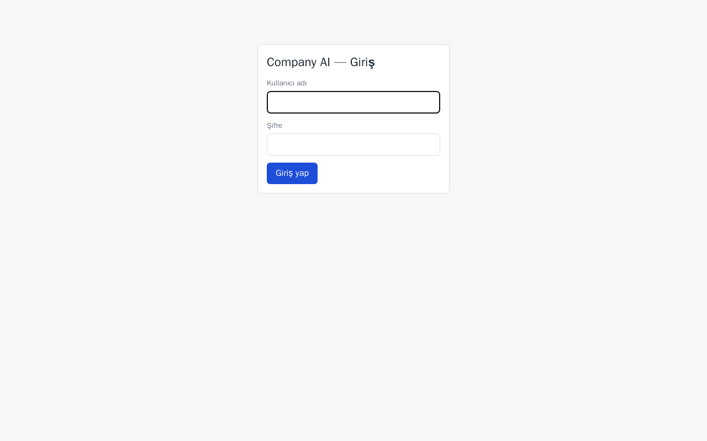 | 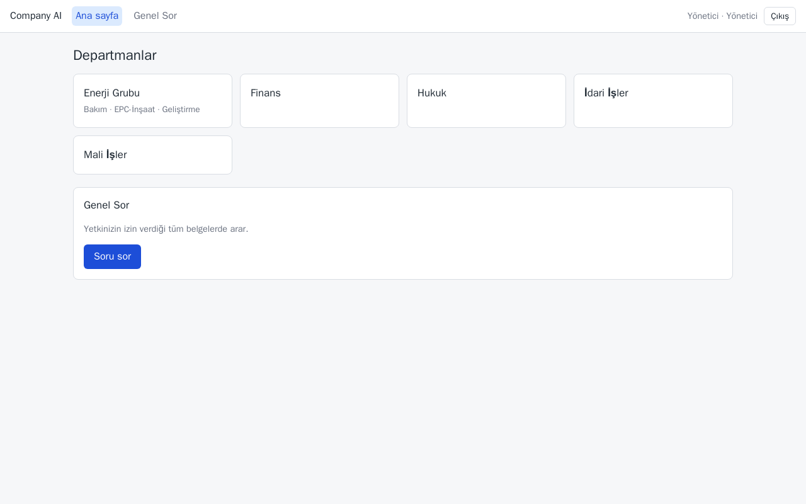 |  |
| 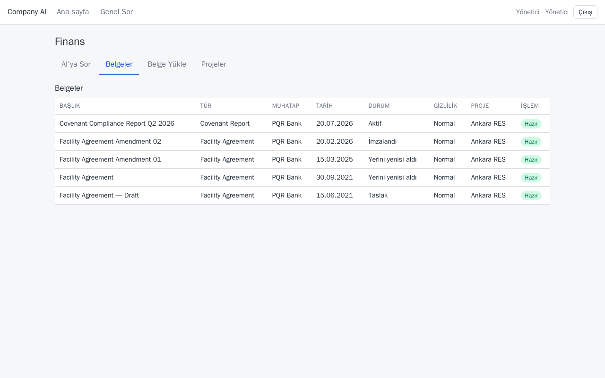 | 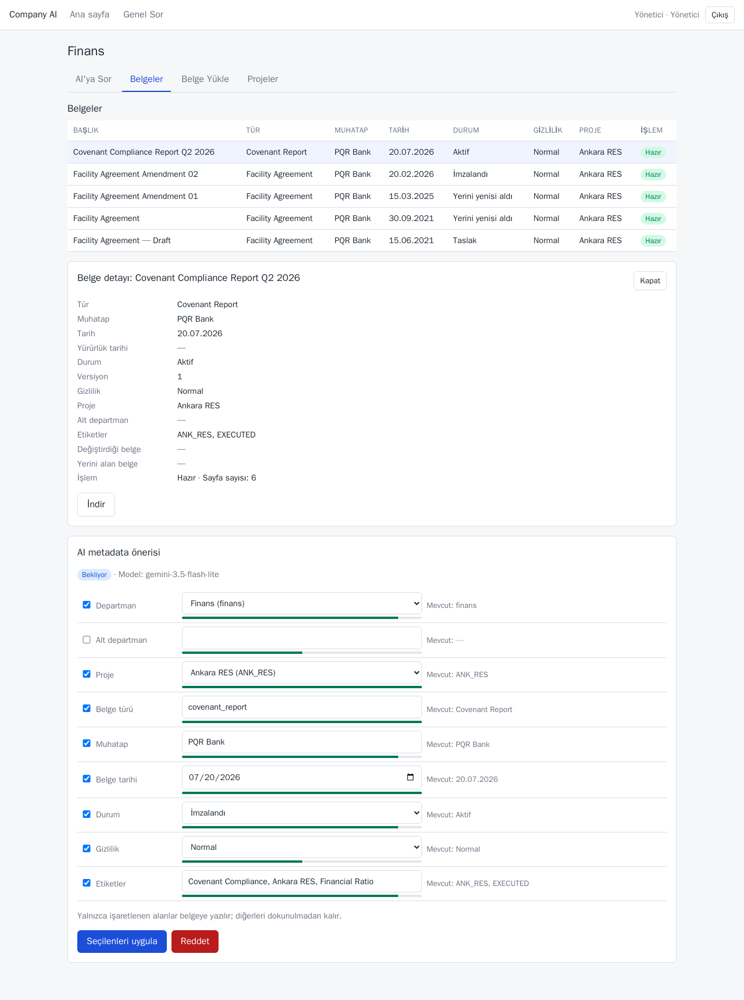 | 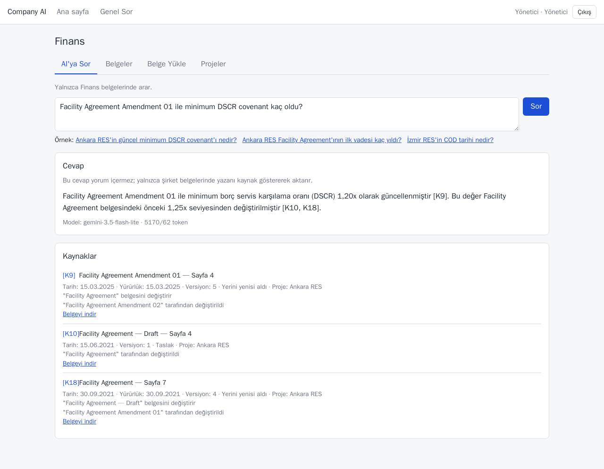 |
| 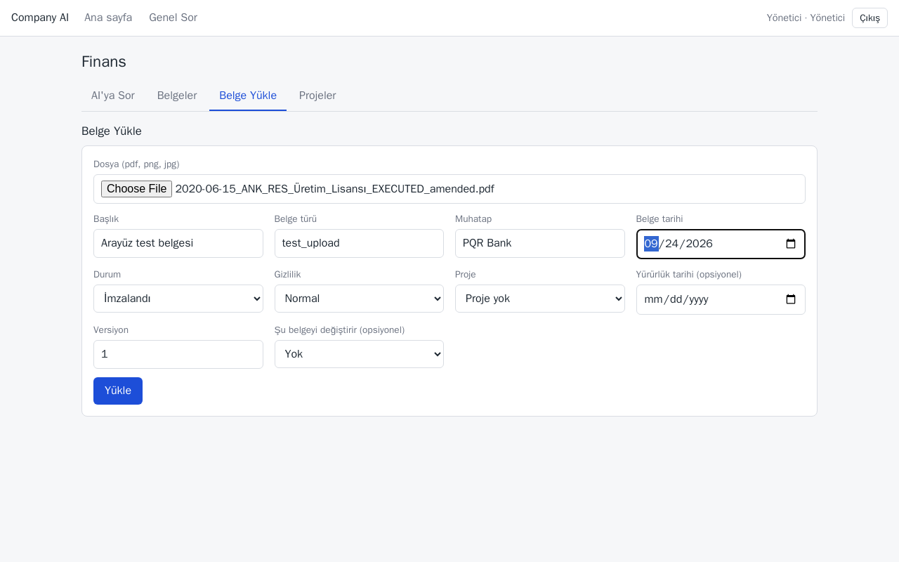 | 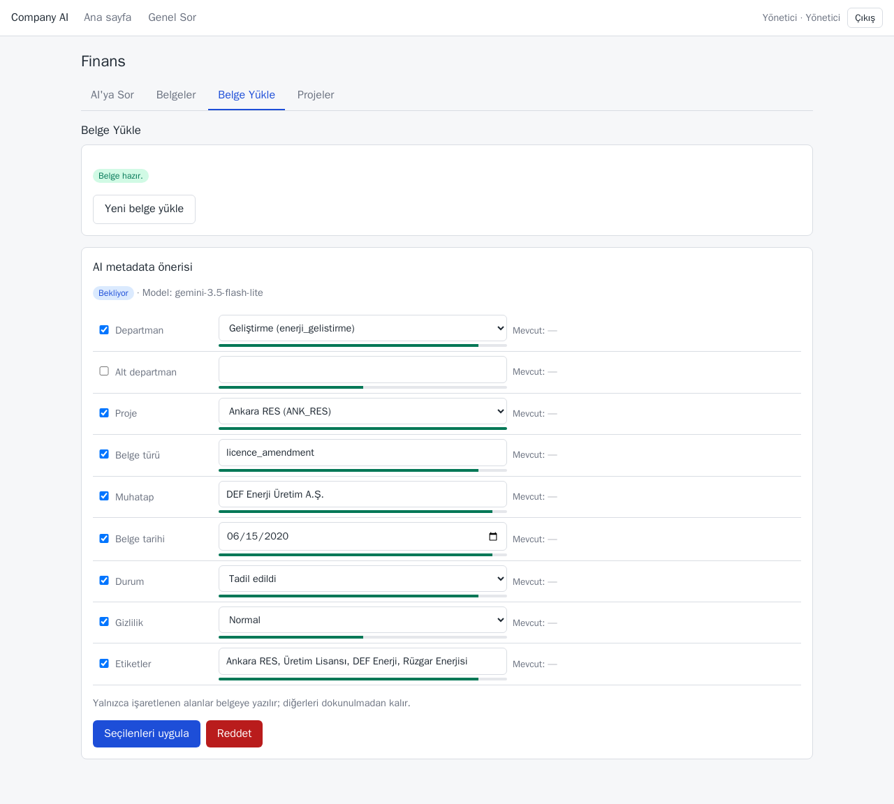 | 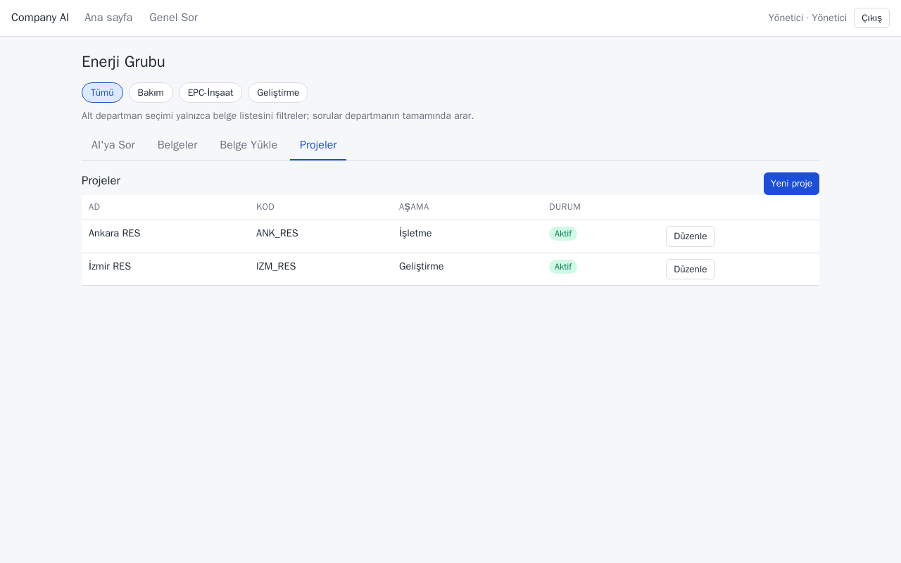 |
| 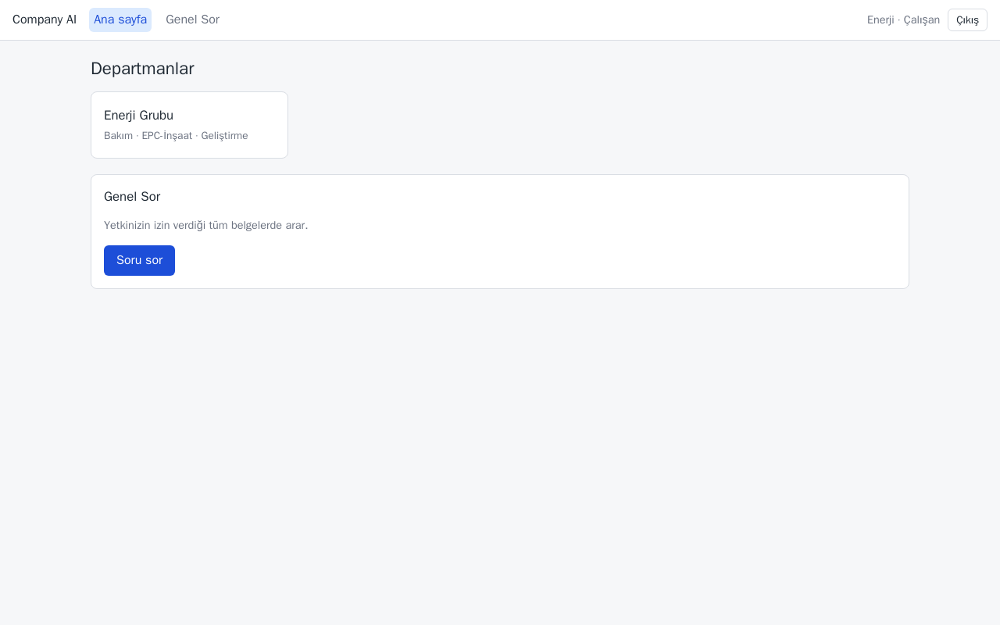 | 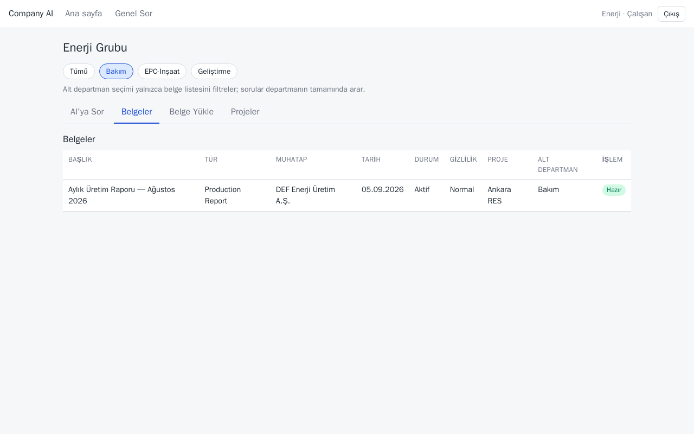 | 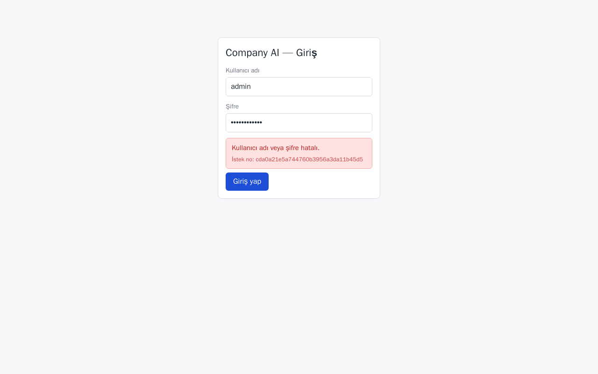 |
| 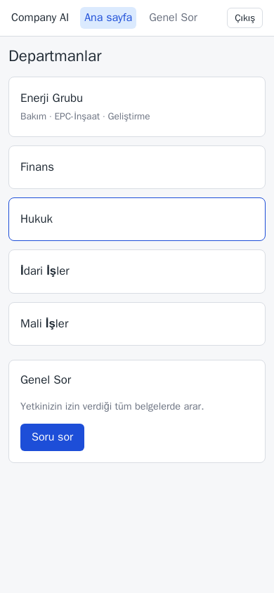 | 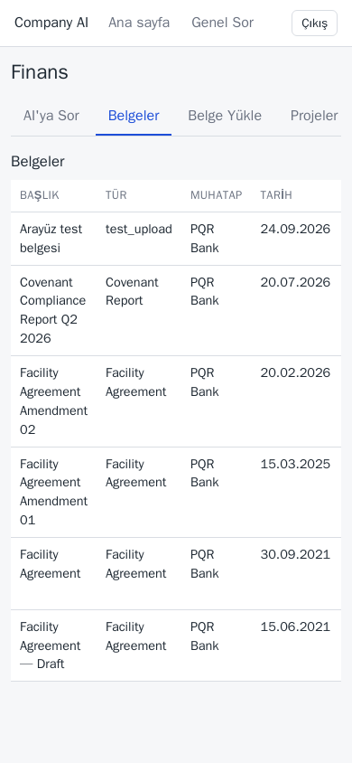 | 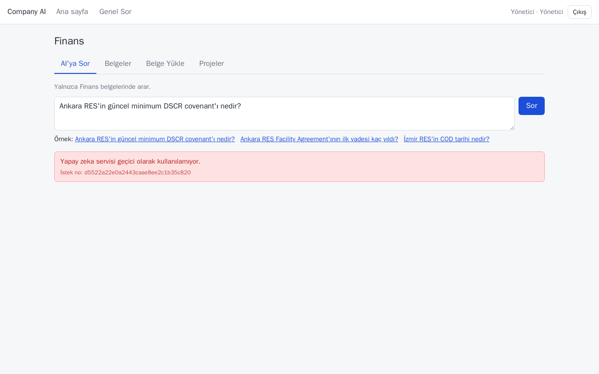 |
